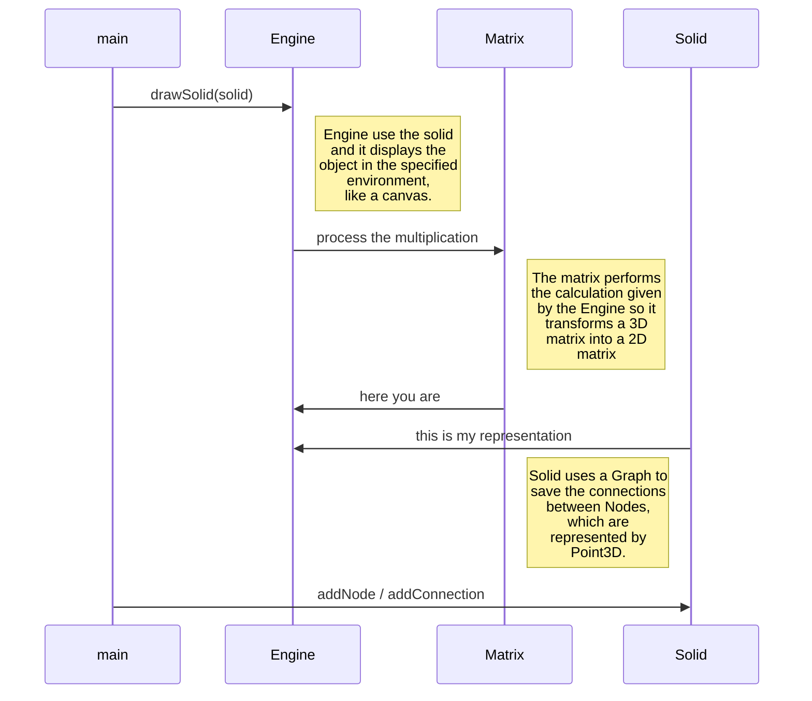

# Engine 3D
**Francesco Forcellato**

This project allows to create solids and display them into whatever you want.
This project was inspired by a project created by [Daniel Shiffman](https://thecodingtrain.com/CodingChallenges/112-3d-rendering) in [Processing](https://processing.org/) but I have made it in the standard Java, so no extra Framework needed.

# Classes
> ``Engine.java`` class used to interact with a ``Solid`` and display it.
> ``Graph.java`` class used to create a graph of the connections in order to connect multiple nodes to each other.
> ``Matrix.java`` it contains all the methods used for managing matrices multiplications.
> ``Point.java`` class used to represent a 2D point.
> ``Point3D.java`` class used to represent a 3D point.
> ``Solid.java`` class used to create a ``Solid``

## Classes usable
To run this project you must at least use an ``Engine`` object and a ``Solid`` object. The ``Engine`` controls the representation of the ``Solid``, so you must create a ``Solid`` and add **nodes** to it, then you can add **connections** between the nodes.

To display the ``Solid`` you have to implement :
>- _drawLine(double x0, double y0, double x1, double y1, Object drawer);_ which allows drawing a line between two points.
>- _beginPath(Object drawer);_ which allows beginning a path (requested from some components like GraphicsContext of JavaFX)
>- _closePath(Object drawer);_ which allows closing a path (requested form some components like GraphicsContext of JavaFX)

## UML diagrams

## V1.0.0
* Create a solid by adding nodes and connections between them
* Rotate a solid by X axes, Y axes, Z axes
* Display a solid by implementing the drawing functions.

## V1.0.1
* Added  a project example using JavaFX
* Change the location of the function ``makeCube(double size)``, now it is in the ``Solid`` class.

Note: in order to run the ``Example`` you must import ``Engine.jar`` in the libraries.
<!--stackedit_data:
eyJoaXN0b3J5IjpbLTg0NTQzMDEwLDU0ODUyNDk5NCwtMTc4Nz
E0NzcyNywtMTkwMzY5MDk4N119
-->